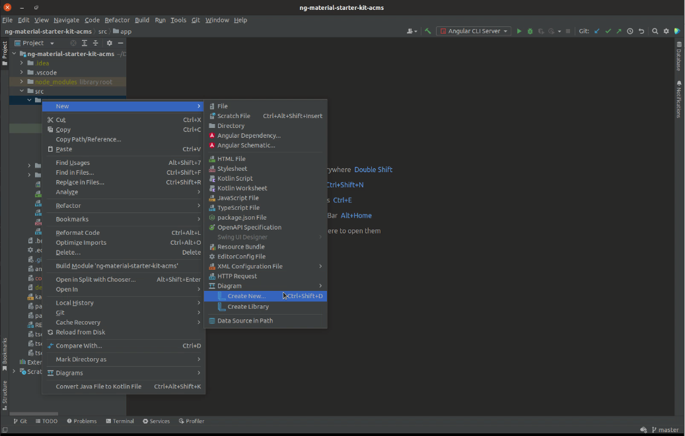
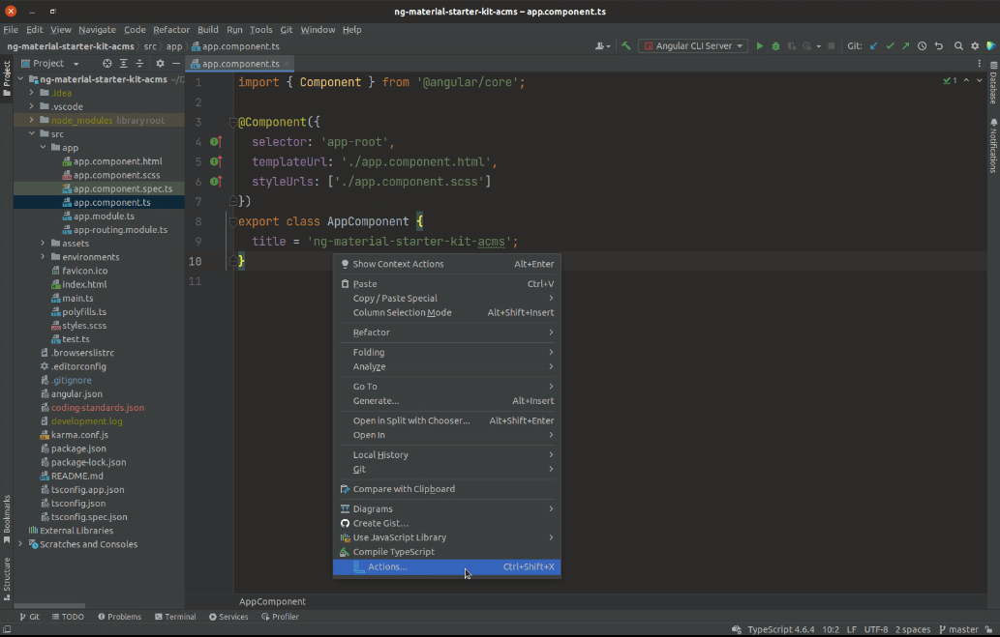

# Lowgular Intro

Let's discover **Lowgular in less than 3 minutes**.

We put a lot of effort to make your Angular development easier, we have designed a lot of features that help you write a better Angular apps faster.

We also created a comprehensive set of resources so you can get started with Lowgular fast.

### Prerequisites

You need to have Webstorm or another IDE from IntelliJ that supports Javascript installed

`VSCode Version comming soon...`

## Getting Started

Get started by **downloading a plugin** from the Marketplace.

Now you have a few options:

### Create New...

Right click in the project tree, select `New` > </img> `Create New...`

Or you can use a shortcut, in the project explorer and press `Ctrl + Shift + D` (`Cmd + Shift + D` on Mac)

Then you will see a list of entities to create.

The default setup ships with a simple architecture: Component, Model and Service.

You can configure the list, head in to the **[coding standards configuration](category/configure-coding-standards)** section for more info.

### Actions...

Open generated typescript or html file in the editor, then right click on it and select: </img> `Actions...`

Or you can use a shortcut, in the editor and press `Ctrl + Shift + X` (`Cmd + Shift + X` on Mac)

Then you will see a list of with available actions.

The actions will differ depending on what type of file is open in the editor.

You can explore more about actions when you head in to the **[features](category/features)** section

### Create Library

You can also create a library that will already setup a linter and testing targets as well scaffold some library code for you.

In a basic setup, it is not very useful because everything is created inside of an App project type, however if you decide to **[configure your coding standards](category/configure-coding-standards)** then you it becomes very useful. Once you do so, head in to **[library section](features/library)** for more info.
