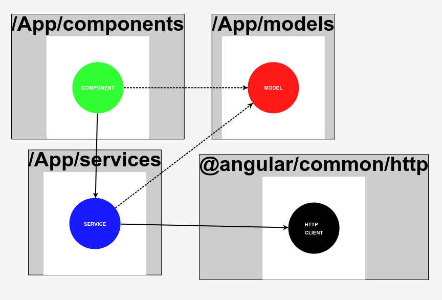
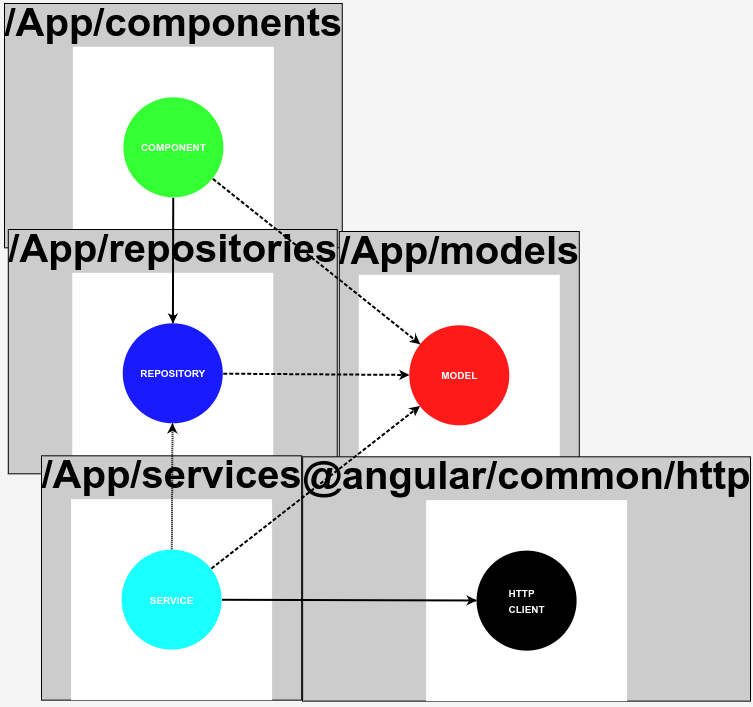
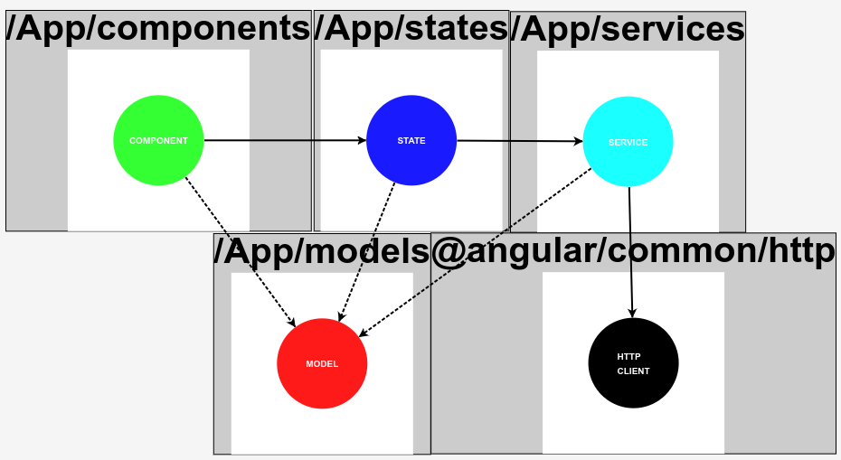
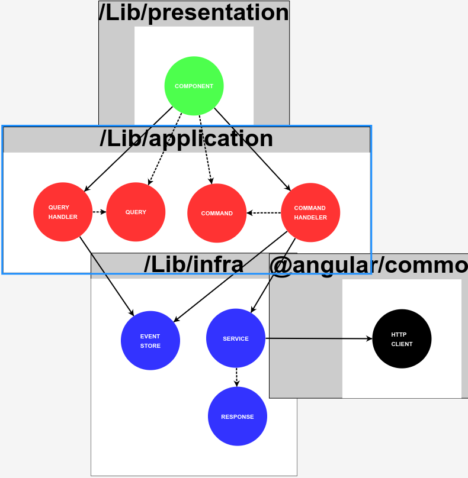

# Architectures

## CMS: Component Model Service

It is an architecture that is loaded by default.

The dependency graph:



`codings-standards.json`:

```
{
  "entityRelations": {
    "component": {
      "model": "PROPERTY",
      "service": "CONSTRUCTOR"
    },
    "service": {
      "httpClient": "CONSTRUCTOR",
      "model": "PARAMETER_AND_RETURN"
    }
  },
  "external": {
    "httpClient": {
      "id": "httpClient",
      "type": "HttpClient",
      "module": "@angular/common/http"
    }
  },
  "entities": {
    "component": {
      "id": "component",
      "type": "ANGULAR_COMPONENT",
      "suffix": "Component",
      "folder": "components/$name$",
      "insideOf": "App",
      "config": {
        "stylesExtension": "none",
        "viewEncapsulation": "None",
        "selector": "generated",
        "changeDetectionStrategy": "OnPush"
      }
    },
    "model": {
      "id": "model",
      "type": "DATA_STRUCTURE",
      "suffix": "Model",
      "folder": "models",
      "insideOf": "App"
    },
    "service": {
      "id": "service",
      "type": "SERVICE",
      "suffix": "Service",
      "folder": "services",
      "insideOf": "App"
    }
  }
}
```

## CMRS: Component Model Repository Service

Following the dependency inversion principle from SOLID.

One can add an abstraction between a `Component` and a `Service`, let's call it a `Repository`



`codings-standards.json`:

```
{
  "entityRelations": {
    "component": {
      "model": "PROPERTY",
      "repository": "CONSTRUCTOR"
    },
    "repository": {
      "model": "PARAMETER_AND_RETURN"
    },
    "service": {
      "httpClient": "CONSTRUCTOR",
      "model": "PARAMETER_AND_RETURN",
      "repository": "IMPLEMENTS"
    }
  },
  "external": {
    "httpClient": {
      "id": "httpClient",
      "type": "HttpClient",
      "module": "@angular/common/http"
    }
  },
  "entities": {
    "component": {
      "id": "component",
      "type": "ANGULAR_COMPONENT",
      "suffix": "Component",
      "folder": "components/$name$",
      "insideOf": "App",
      "config": {
        "stylesExtension": "none",
        "viewEncapsulation": "None",
        "selector": "generated",
        "changeDetectionStrategy": "OnPush"
      }
    },
    "model": {
      "id": "model",
      "type": "DATA_STRUCTURE",
      "suffix": "Model",
      "folder": "models",
      "insideOf": "App"
    },
    "repository": {
      "id": "repository",
      "type": "ABSTRACTION",
      "suffix": "Repository",
      "folder": "repositories",
      "insideOf": "App"
    },
    "service": {
      "id": "service",
      "type": "SERVICE",
      "suffix": "Service",
      "folder": "services",
      "insideOf": "App"
    }
  }
}
```

## Basic State

Sometimes you want to create the application layer between your presentation and data layers.

This will allow you to solve reactivity issues as well as start having all the business logic and use cases in one place that can be reused for other components.



`codings-standards.json`:

```
{
  "entityRelations": {
    "component": {
      "state": "CONSTRUCTOR",
      "model": "PROPERTY"
    },
    "state": {
      "service": "CONSTRUCTOR",
      "model": "PARAMETER_AND_RETURN"
    },
    "service": {
      "httpClient": "CONSTRUCTOR",
      "model": "PARAMETER_AND_RETURN"
    }
  },
  "external": {
    "httpClient": {
      "id": "httpClient",
      "type": "HttpClient",
      "module": "@angular/common/http"
    }
  },
  "entities": {
    "component": {
      "id": "component",
      "type": "ANGULAR_COMPONENT",
      "suffix": "Component",
      "folder": "components/$name$",
      "insideOf": "App",
      "config": {
        "stylesExtension": "none",
        "viewEncapsulation": "None",
        "selector": "generated",
        "changeDetectionStrategy": "OnPush"
      }
    },
    "model": {
      "id": "model",
      "type": "DATA_STRUCTURE",
      "suffix": "Model",
      "folder": "models",
      "insideOf": "App"
    },
    "state": {
      "id": "state",
      "type": "SERVICE",
      "suffix": "State",
      "folder": "states",
      "insideOf": "App"
    },
    "service": {
      "id": "service",
      "type": "SERVICE",
      "suffix": "Service",
      "folder": "services",
      "insideOf": "App"
    }
  }
}
```

## CQRS: Command Query Responsibility Segregation

Fancy something more advanced? Tired of a simple state management systems?

Maybe this could be a solution to your problems.



`codings-standards.json`:

```
{
  "entityRelations": {
    "component": {
      "queryHandler": "CONSTRUCTOR",
      "commandHandeler": "CONSTRUCTOR",
      "query": "PROPERTY",
      "command": "PROPERTY"
    },
    "queryHandler": {
      "eventStore": "CONSTRUCTOR",
      "query": "RETURN"
    },
    "commandHandeler": {
      "service": "CONSTRUCTOR",
      "eventStore": "CONSTRUCTOR",
      "command": "PARAMETER"
    },
    "service": {
      "httpClient": "CONSTRUCTOR",
      "response": "RETURN"
    }
  },
  "external": {
    "httpClient": {
      "id": "httpClient",
      "type": "HttpClient",
      "module": "@angular/common/http"
    }
  },
  "entities": {
    "component": {
      "id": "component",
      "type": "ANGULAR_COMPONENT",
      "suffix": "Component",
      "folder": "presentation/components/$name$",
      "insideOf": "Lib",
      "config": {
        "stylesExtension": "none",
        "viewEncapsulation": "None",
        "selector": "generated",
        "changeDetectionStrategy": "OnPush"
      }
    },
    "query": {
      "id": "query",
      "type": "DATA_STRUCTURE",
      "suffix": "Query",
      "folder": "application/query-handlers",
      "insideOf": "Lib"
    },
    "queryHandler": {
      "id": "queryHandler",
      "type": "SERVICE",
      "suffix": "QueryHandler",
      "folder": "application/query-handlers",
      "insideOf": "Lib"
    },
    "command": {
      "id": "command",
      "type": "DATA_STRUCTURE",
      "suffix": "Command",
      "folder": "application/command-handlers",
      "insideOf": "Lib"
    },
    "commandHandeler": {
      "id": "commandHandeler",
      "type": "SERVICE",
      "suffix": "CommandHandler",
      "folder": "application/command-handlers",
      "insideOf": "Lib"
    },
    "eventStore": {
      "id": "eventStore",
      "type": "SERVICE",
      "suffix": "EventStore",
      "folder": "infra/events",
      "insideOf": "Lib"
    },
    "service": {
      "id": "service",
      "type": "SERVICE",
      "suffix": "Service",
      "folder": "infra/services",
      "insideOf": "Lib"
    },
    "response": {
      "id": "response",
      "type": "DATA_STRUCTURE",
      "suffix": "Response",
      "folder": "infra/responses",
      "insideOf": "Lib"
    }
  }
}
```

## Hexagonal Architecture

This is by far the most flexible, extensible and de-coupled architecture we have worked with.

You might not need it for simple cases, but it scales very well


`codings-standards.json`:

```
{
  "entityRelations": {
    "page": {
      "component": "HTML"
    },
    "component": {
      "commandPort": "CONSTRUCTOR",
      "queryPort": "CONSTRUCTOR",
      "command": "PARAMETER",
      "query": "PROPERTY"
    },
    "directive": {
      "commandPort": "CONSTRUCTOR",
      "queryPort": "CONSTRUCTOR",
      "command": "PARAMETER",
      "query": "PROPERTY"
    },
    "guard": {
      "queryPort": "CONSTRUCTOR",
      "query": "PROPERTY"
    },
    "resolver": {
      "commandPort": "CONSTRUCTOR",
      "command": "PARAMETER"
    },
    "eventHandler": {
      "commandPort": "CONSTRUCTOR",
      "command": "PARAMETER"
    },
    "commandPort": {
      "command": "PARAMETER"
    },
    "queryPort": {
      "query": "RETURN"
    },
    "state": {
      "command": "PARAMETER",
      "query": "RETURN",
      "commandPort": "IMPLEMENTS",
      "queryPort": "IMPLEMENTS",
      "contextPort": "CONSTRUCTOR",
      "dtoPort": "CONSTRUCTOR",
      "eventPort": "CONSTRUCTOR"
    },
    "contextPort": {
      "context": "PARAMETER_AND_RETURN"
    },
    "dtoPort": {
      "dto": "PARAMETER_AND_RETURN"
    },
    "eventPort": {
      "event": "PARAMETER"
    },
    "storage": {
      "contextPort": "IMPLEMENTS",
      "context": "PARAMETER_AND_RETURN"
    },
    "dataService": {
      "dtoPort": "IMPLEMENTS",
      "httpClient": "CONSTRUCTOR",
      "dto": "PARAMETER_AND_RETURN",
      "responseObject": "PARAMETER"
    },
    "eventDispatcher": {
      "eventPort": "IMPLEMENTS",
      "event": "PARAMETER"
    }
  },
  "external": {
    "httpClient": {
      "id": "httpClient",
      "type": "HttpClient",
      "module": "@angular/common/http"
    }
  },
  "entities": {
    "component": {
      "id": "component",
      "type": "ANGULAR_COMPONENT",
      "suffix": "Component",
      "folder": "adapters/primary/components/$name$",
      "insideOf": "Lib",
      "config": {
        "stylesExtension": "scss",
        "viewEncapsulation": "Emulated",
        "selector": "generated",
        "changeDetectionStrategy": "OnPush"
      }
    },
    "directive": {
      "id": "directive",
      "type": "ANGULAR",
      "suffix": "Directive",
      "folder": "adapters/primary/directives/$name$",
      "insideOf": "Lib"
    },
    "resolver": {
      "id": "resolver",
      "type": "ANGULAR",
      "suffix": "Resolver",
      "folder": "adapters/primary/resolvers/$name$",
      "insideOf": "Lib"
    },
    "guard": {
      "id": "guard",
      "type": "ANGULAR",
      "suffix": "Guard",
      "folder": "adapters/primary/guards/$name$",
      "insideOf": "Lib"
    },
    "eventHandler": {
      "id": "eventHandler",
      "type": "SERVICE",
      "suffix": "EventHandler",
      "folder": "adapters/primary/event-handlers/$name$",
      "insideOf": "Lib"
    },
    "command": {
      "id": "command",
      "type": "OBJECT",
      "suffix": "Command",
      "folder": "application/ports/primary/command",
      "insideOf": "Lib"
    },
    "commandPort": {
      "id": "commandPort",
      "type": "ABSTRACTION",
      "suffix": "CommandPort",
      "folder": "application/ports/primary/command",
      "insideOf": "Lib"
    },
    "query": {
      "id": "query",
      "type": "OBJECT",
      "suffix": "Query",
      "folder": "application/ports/primary/query",
      "insideOf": "Lib"
    },
    "queryPort": {
      "id": "queryPort",
      "type": "ABSTRACTION",
      "suffix": "QueryPort",
      "folder": "application/ports/primary/query",
      "insideOf": "Lib"
    },
    "state": {
      "id": "state",
      "type": "SERVICE",
      "suffix": "State",
      "folder": "application/state",
      "insideOf": "Lib"
    },
    "event": {
      "id": "event",
      "type": "DATA_STRUCTURE",
      "suffix": "Event",
      "folder": "application/ports/secondary/event",
      "insideOf": "Lib"
    },
    "eventPort": {
      "id": "eventPort",
      "type": "ABSTRACTION",
      "suffix": "EventPort",
      "folder": "application/ports/secondary/event",
      "insideOf": "Lib"
    },
    "dto": {
      "id": "dto",
      "type": "DATA_STRUCTURE",
      "suffix": "DTO",
      "folder": "application/ports/secondary/dto",
      "insideOf": "Lib"
    },
    "dtoPort": {
      "id": "dtoPort",
      "type": "ABSTRACTION",
      "suffix": "DtoPort",
      "folder": "application/ports/secondary/dto",
      "insideOf": "Lib"
    },
    "context": {
      "id": "context",
      "type": "DATA_STRUCTURE",
      "suffix": "Context",
      "folder": "application/ports/secondary/context",
      "insideOf": "Lib"
    },
    "contextPort": {
      "id": "contextPort",
      "type": "ABSTRACTION",
      "suffix": "ContextPort",
      "folder": "application/ports/secondary/context",
      "insideOf": "Lib"
    },
    "dataService": {
      "id": "dataService",
      "type": "SERVICE",
      "suffix": "Service",
      "folder": "adapters/secondary/services",
      "insideOf": "Lib"
    },
    "responseObject": {
      "id": "responseObject",
      "type": "DATA_STRUCTURE",
      "suffix": "Response",
      "folder": "adapters/secondary/services",
      "insideOf": "Lib"
    },
    "storage": {
      "id": "storage",
      "type": "SERVICE",
      "suffix": "Storage",
      "folder": "adapters/secondary/storages",
      "insideOf": "Lib"
    },
    "eventDispatcher": {
      "id": "eventDispatcher",
      "type": "SERVICE",
      "suffix": "EventDispatcher",
      "folder": "adapters/secondary/event-dispatchers",
      "insideOf": "Lib"
    },
    "page": {
      "id": "page",
      "type": "ANGULAR_COMPONENT",
      "suffix": "Page",
      "folder": "pages",
      "insideOf": "App",
      "config": {
        "stylesExtension": "none",
        "viewEncapsulation": "None",
        "selector": "none",
        "changeDetectionStrategy": "OnPush"
      }
    }
  }
}
```
